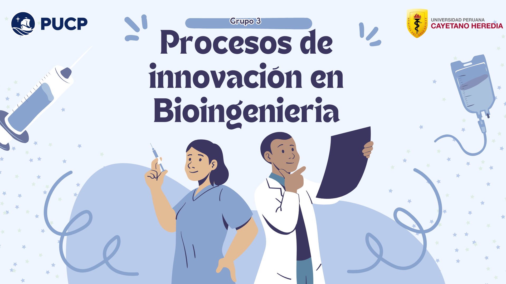
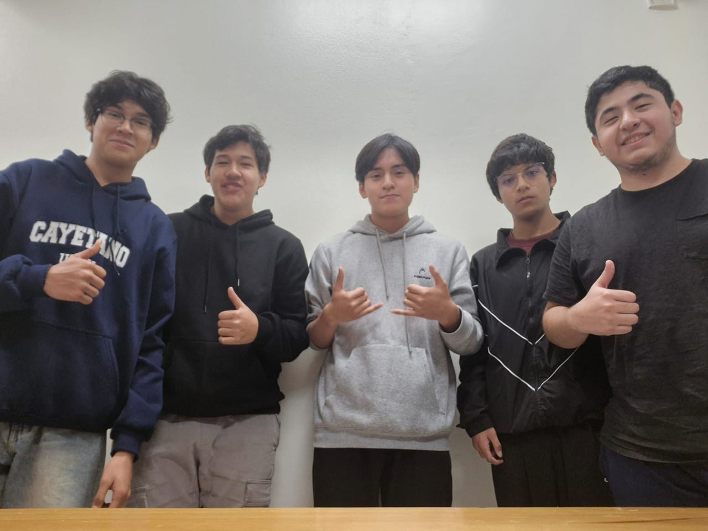
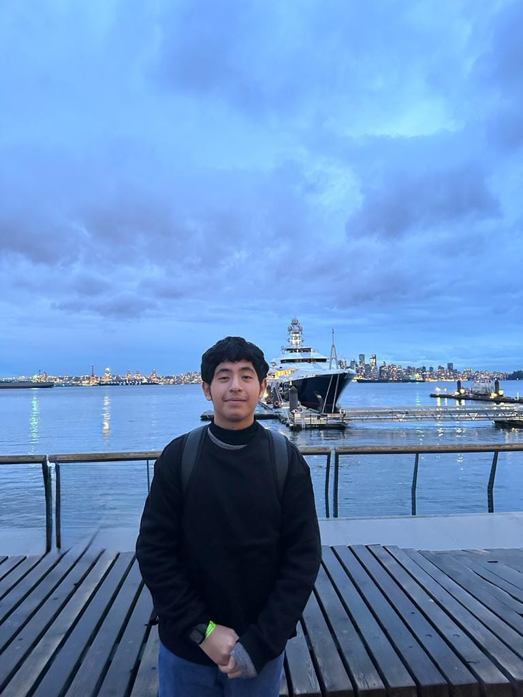

# GRUPO 3

## 🤖DESCRIPCION DEL GRUPO 🤖
Somos un grupo de estudiantes de segundo ciclo de la carrera de ingenieria Biomedica (UPCH y PUCP) formamos parte del horario PIB5 del curso procesos de innovacion en bioingenieria y la finalidad de este repositorio es demostrar lo aprendido en la sesion numero 2 sobre git y github.

### Integrantes del grupo:

1-.Giovanni Guardamino
FOTO

Edad: 18 años

Pasatiempo: Jugar videojuegos 

Curso favorito del segundo ciclo: Calculo diferencial

Area biomedica: Ingenieria clinica

2-.Alonso Diego Vasquez Guillen

Edad: 18 años

Pasatiempo: Jugar videojuegos, ajedrez y ver series y peliculas

Curso favorito del segundo ciclo: Fisica 1

Area biomedica: Tejidos y biomateriales
