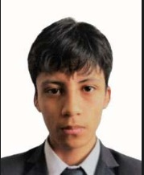

# GRUPO 3

## 🤖DESCRIPCION DEL GRUPO 🤖
Somos un grupo de estudiantes de segundo ciclo de la carrera de ingenieria Biomedica (UPCH y PUCP) formamos parte del horario PIB5 del curso procesos de innovacion en bioingenieria y la finalidad de este repositorio es demostrar lo aprendido en la sesion numero 2 sobre git y github.

### Integrantes del grupo:

1-.Giovanni Guardamino
FOTO

Edad: 18 años

Pasatiempo: Jugar videojuegos 

Curso favorito del segundo ciclo: Calculo diferencial

Area de interes biomedica: Ingenieria clinica

2-.Alonso Diego Vasquez Guillen

Edad: 18 años

Pasatiempo: Jugar videojuegos, ajedrez y ver series y peliculas

Curso favorito del segundo ciclo: Fisica 1

Area de interes biomedica: Tejidos y biomateriales

3-.Alonso Martin Cuadros Huarcaya

Edad: 18 años

Pasatiempo: Escuchar musica, tocar piano y practicar natacion

Curso favorito del segundo ciclo: Diseño industrial 

Area de interes biomedica: Biomecanica

4-. Guillermo Eduardo Ancel Quezada Ponciano 

Edad:

Pasatiempo:

Curso favorito del segundo ciclo:

Area de interes biomedica:

5-.Juan Pablo Bravo Larico

Edad: 17 años

Pasatiempo: Ver videos y jugar videojuegos

Curso favorito del segundo ciclo: Quimica general 

Area de interes biomedica: Tejidos y biomateriales
